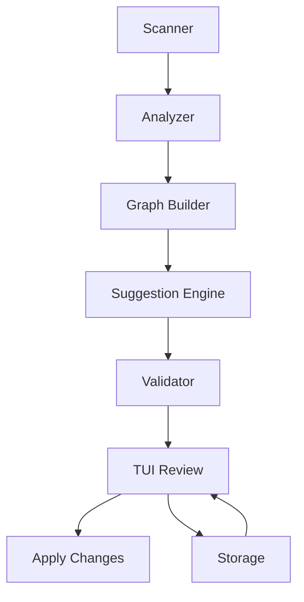

# Architecture

## Overview
Modules:
- Scanner: discover files and metadata
- Analyzer: extract text/image signals and call AI
- Graph Builder: build relationships and clusters
- Suggestion Engine: propose rename/move/no-change
- Validator: apply rules and safe naming
- TUI: user review and apply
- Storage: history, suggestions, undo

## Mermaid Diagram

## Key Rules
- No AI content for binary files.
- Apply changes in a stable order.
- Undo log written before changes.
